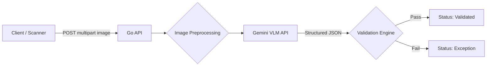

# Phase 2: Go Ingestion & Validation API — Planning

## Objective
Wrap the proven VLM extraction (Phase 1) in a deterministic Go backend that receives trip sheet images, calls the VLM, validates the structured output against business rules, and routes payloads to either `Validated` or `Exception` status.

---

## Architecture



## Project Structure (Go Standard Layout)

```
server/
├── cmd/
│   └── api/
│       └── main.go              # Entry point, dependency wiring, server start
├── internal/
│   ├── domain/
│   │   └── trip.go              # TripSheet, LineItem structs + validation tags
│   ├── handler/
│   │   └── trip_handler.go      # HTTP handler: POST /api/v1/trips/extract
│   ├── service/
│   │   ├── extraction.go        # Calls VLM, returns TripSheet
│   │   └── validation.go        # Arithmetic cross-checks, confidence routing
│   └── preprocessing/
│       └── image.go             # Grayscale + contrast boost for mobile photos
├── go.mod
└── go.sum
```

---

## Engineering Decisions

### 1. Router: `chi`
- Lightweight, idiomatic, fully compatible with `net/http`.
- Built-in middleware for logging, request IDs, recovery.
- Sub-routers for API versioning (`/api/v1/...`).

### 2. Validation: `go-playground/validator`
- Struct tag-based validation on the `TripSheet` struct.
- Enforces required fields and data types at the handler level.
- Custom validators for business-specific rules.

### 3. Endpoint Design

#### `POST /api/v1/trips/extract`
- **Input**: Multipart form with a single image file.
- **Processing Pipeline**:
  1. Parse multipart form (limit: 10MB).
  2. Validate MIME type via `http.DetectContentType` (accept `image/jpeg`, `image/png`).
  3. If mobile photo detected → apply grayscale + contrast preprocessing.
  4. Send image bytes to Gemini VLM API.
  5. Unmarshal JSON response into `domain.TripSheet` struct.
  6. Run deterministic validation guardrails.
  7. Return the validated (or exception-flagged) payload.
- **Output**: JSON response with extracted data + `status` field.

### 4. Deterministic Cross-Checks (Guardrails)

These are the arithmetic business rules that the Go backend enforces **after** the VLM returns its extraction:

| Check | Rule | On Failure |
|-------|------|------------|
| **Odometer Delta** | `odometer_close - odometer_open ≈ total_miles` (±5% tolerance) | Status → Exception |
| **Line Item Sum** | `sum(line_items[].miles) ≈ total_miles` (±5% tolerance) | Status → Exception |
| **Confidence Threshold** | `confidence_score > 0.85` | Status → Exception |
| **Required Fields** | `odometer_open`, `odometer_close` must be non-null | Status → Exception |
| **Odometer Sanity** | `odometer_close > odometer_open` | Status → Exception |

### 5. Image Preprocessing
For mobile photos (lower quality), apply a lightweight preprocessing step before sending to the VLM:
- **Grayscale conversion**: Reduces noise from color artifacts.
- **Contrast boost**: Improves text legibility on shadowed/dark images.
- **Library**: Standard Go `image` package + `disintegration/imaging` for filters.

### 6. Response Shape

```json
{
  "status": "validated",
  "trip_sheet": {
    "odometer_open": 187421,
    "odometer_close": 187815,
    "total_miles": 394,
    "line_items": [...],
    "confidence_score": 0.95,
    "flagged_fields": []
  },
  "validation": {
    "odometer_delta_check": "pass",
    "line_item_sum_check": "pass",
    "confidence_check": "pass",
    "errors": []
  }
}
```

Exception example:
```json
{
  "status": "exception",
  "trip_sheet": { ... },
  "validation": {
    "odometer_delta_check": "fail",
    "line_item_sum_check": "pass",
    "confidence_check": "pass",
    "errors": [
      "Odometer delta (394) does not match total_miles (500) — difference exceeds 5% tolerance"
    ]
  }
}
```

---

## Dependencies

| Package | Purpose |
|---------|---------|
| `github.com/go-chi/chi/v5` | HTTP router |
| `github.com/go-playground/validator/v10` | Struct validation |
| `github.com/disintegration/imaging` | Image preprocessing |
| `github.com/google/generative-ai-go` | Gemini API client |

---

## Implementation Order

1. **Scaffold** — `go mod init`, directory structure, `main.go` with chi router
2. **Domain structs** — `TripSheet`, `LineItem` with validator tags
3. **Extraction service** — Call Gemini API with image bytes, return `TripSheet`
4. **Validation service** — Arithmetic guardrails + confidence routing
5. **Handler** — Wire it all together in `POST /api/v1/trips/extract`
6. **Preprocessing** — Add optional image enhancement step
