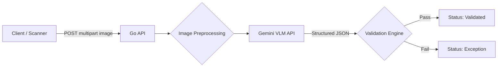

# Phase 2: Go Ingestion & Validation API — Planning

## Context

> The AI handles **only** unstructured data extraction. **Deterministic code** handles all validation. This separation ensures high accuracy without silent data corruption.

Once the VLM (Phase 1) consistently outputs valid JSON, we wrap it in a Go service to enforce business rules deterministically. The Go backend is the trust boundary — the VLM's output is treated as untrusted input that must pass through arithmetic and schema validation before being accepted.

## Objective

Build an API-first Go service that:
1. Accepts a trip sheet image via multipart upload
2. Optionally preprocesses the image for quality improvement
3. Sends the image to the Gemini VLM for structured extraction
4. Runs deterministic cross-checks on the extracted data
5. Routes the result to either `validated` or `exception` status

---

## Architecture



## Project Structure

```
server/
├── cmd/api/main.go                    # Entry point, dependency wiring
├── internal/
│   ├── domain/trip.go                 # TripSheet, LineItem structs + validation tags
│   ├── handler/trip_handler.go        # HTTP handler: POST /api/v1/trips/extract
│   ├── service/
│   │   ├── extraction.go             # Calls VLM, returns TripSheet
│   │   └── validation.go             # Arithmetic cross-checks, confidence routing
│   └── preprocessing/image.go        # Grayscale + contrast boost for mobile photos
```

## Engineering Decisions

### 1. Router: `chi`
- Lightweight, idiomatic, fully compatible with `net/http`
- Built-in middleware for logging, request IDs, recovery
- Sub-routers for API versioning (`/api/v1/...`)

### 2. Validation: Deterministic Guardrails
The VLM's output is **untrusted input**. The Go backend enforces these checks:

| # | Check | Rule | On Failure |
|---|-------|------|------------|
| 1 | Required Fields | `odometer_open`, `odometer_close` must be non-null | → Exception |
| 2 | Odometer Sanity | `odometer_close > odometer_open` | → Exception |
| 3 | Odometer Delta | `close - open ≈ total_miles` (±5% tolerance) | → Exception |
| 4 | Line Item Sum | `sum(line_items[].miles) ≈ total_miles` (±5% tolerance) | → Exception |
| 5 | Confidence | `confidence_score > 0.85` | → Exception |

### 3. Image Preprocessing
For mobile photos (lower quality), an optional preprocessing step is applied before sending to the VLM:
- **Grayscale conversion** — reduces noise from color artifacts
- **Contrast boost (+30)** — improves text legibility on shadowed/dark images
- **Sharpening** — improves edge definition on blurry photos
- Triggered via query parameter: `?preprocess=true`

### 4. Security
- **MIME validation**: `http.DetectContentType` on raw bytes (not file extension)
- **File size limit**: 10MB max upload
- **No user-provided filenames** stored — UUIDs only

## Response Shape

### Validated
```json
{
  "status": "validated",
  "trip_sheet": {
    "odometer_open": 102450,
    "odometer_close": 102780,
    "total_miles": 436,
    "line_items": [...],
    "confidence_score": 1.0,
    "flagged_fields": []
  },
  "validation": {
    "odometer_delta_check": "pass",
    "line_item_sum_check": "pass",
    "confidence_check": "pass",
    "errors": []
  }
}
```

### Exception
```json
{
  "status": "exception",
  "trip_sheet": { "..." },
  "validation": {
    "odometer_delta_check": "fail",
    "errors": ["Odometer delta (330) does not match total_miles (436) — deviation 24.3% exceeds 5% tolerance"]
  }
}
```

## Dependencies

| Package | Purpose |
|---------|---------|
| `github.com/go-chi/chi/v5` | HTTP router |
| `github.com/google/generative-ai-go` | Gemini API client |
| `github.com/disintegration/imaging` | Image preprocessing |

## Files

- [`server/cmd/api/main.go`](../server/cmd/api/main.go) — Entry point
- [`server/internal/handler/trip_handler.go`](../server/internal/handler/trip_handler.go) — HTTP handler
- [`server/internal/service/extraction.go`](../server/internal/service/extraction.go) — VLM extraction service
- [`server/internal/service/validation.go`](../server/internal/service/validation.go) — Validation engine
- [`server/internal/preprocessing/image.go`](../server/internal/preprocessing/image.go) — Image enhancement
