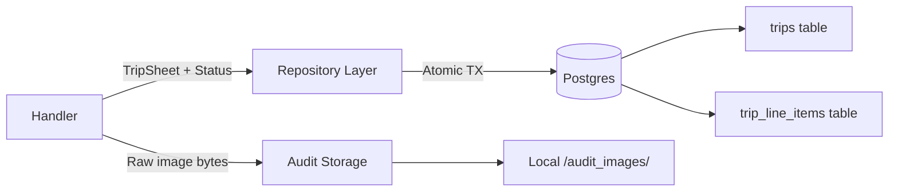

# Phase 3: Persistence (Postgres) — Planning

## Objective
Persist extracted and validated trip sheet data to Postgres with full audit trail, using atomic transactions and local image storage for the POC.

---

## Architecture



## Database Schema

### `trips` table
| Column | Type | Notes |
|--------|------|-------|
| id | UUID | Primary key, auto-generated |
| odometer_open | INTEGER | Nullable |
| odometer_close | INTEGER | Nullable |
| total_miles | INTEGER | Nullable |
| confidence_score | FLOAT | VLM confidence |
| flagged_fields | TEXT[] | Postgres array |
| status | VARCHAR(20) | `validated` or `exception` |
| validation_errors | TEXT[] | Array of error messages |
| image_path | TEXT | Path to the stored audit image |
| created_at | TIMESTAMPTZ | Auto-set |

### `trip_line_items` table
| Column | Type | Notes |
|--------|------|-------|
| id | UUID | Primary key |
| trip_id | UUID | FK → trips.id |
| date | VARCHAR(20) | As written on sheet |
| location | TEXT | |
| miles | INTEGER | Nullable |
| sort_order | INTEGER | Preserves row order from the sheet |

## Engineering Decisions

### 1. Driver: `pgx/v5`
- Pure Go, no CGO dependency.
- Native support for Postgres arrays (`TEXT[]`), UUIDs, connection pooling.
- `pgxpool` for connection pool management.

### 2. Migrations: `golang-migrate`
- SQL-based migration files in `server/migrations/`.
- Clean up/down migrations for reproducibility.

### 3. Transaction Pattern
- Single atomic transaction per trip: insert `trips` row → bulk insert `trip_line_items`.
- On any failure, the entire transaction rolls back — no partial data.

### 4. Audit Image Storage
- **POC**: Save raw images to a local `audit_images/` directory, keyed by trip UUID.
- **Production**: Swap to S3/GCS with the same interface (path stored in DB either way).

### 5. Repository Interface
Clean separation — the handler calls the repository, not raw SQL:
```go
type TripRepository interface {
    SaveTrip(ctx context.Context, trip *domain.TripRecord) error
}
```

## Implementation Order
1. Migration SQL files
2. Repository layer with pgx
3. Audit image storage utility
4. Update handler to persist after validation
5. Wire DB connection in main.go
