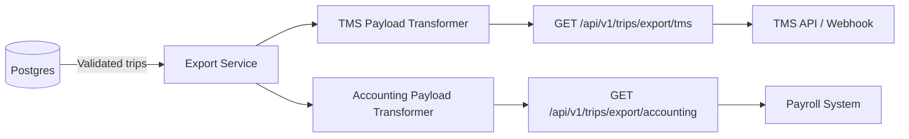

# Phase 4: TMS/Accounting Hand-off — Planning

## Objective
Prove the end-to-end value of the MVP by transforming validated trip data into the specific JSON shapes required by downstream TMS (Transportation Management System) and Accounting/Payroll systems.

**The POC Goal:** Physical paper in → validated payroll and dispatch data out.

---

## Architecture



## Payload Shapes

### TMS Export (Dispatch)
The TMS system needs route and mileage data for dispatch tracking:
```json
{
  "export_type": "tms_dispatch",
  "exported_at": "2026-07-23T...",
  "trips": [
    {
      "trip_id": "uuid",
      "total_miles": 436,
      "route_segments": [
        {"origin": "Chicago, IL", "destination": "Milwaukee, WI", "miles": 92, "date": "7/01/24"}
      ],
      "odometer": {"start": 102450, "end": 102780}
    }
  ]
}
```

### Accounting Export (Payroll)
The accounting system needs cost-basis data for driver payroll:
```json
{
  "export_type": "accounting_payroll",
  "exported_at": "2026-07-23T...",
  "pay_items": [
    {
      "trip_id": "uuid",
      "date_range": {"start": "7/01/24", "end": "7/02/24"},
      "total_miles": 436,
      "billable_miles": 436,
      "rate_per_mile": 0.55,
      "total_pay": 239.80
    }
  ]
}
```

## Engineering Decisions

### 1. Only export `validated` trips
Exception-flagged trips must be reviewed by a human first. The export endpoints will filter to `status = 'validated'` only.

### 2. Simulated webhook
For the POC, we use GET endpoints that return the transformed payload. In production, these would be replaced with outbound webhooks or message queue publishers.

### 3. Rate per mile
Hardcoded at $0.55/mile for the POC. In production, this would come from a driver contract or rate table.

## Implementation Order
1. Export service — payload transformation logic
2. Export handler — HTTP endpoints
3. Wire into main.go
