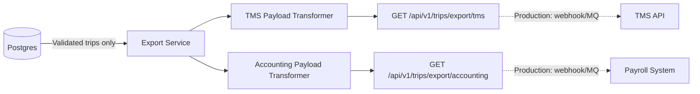

# Phase 4: TMS/Accounting Hand-off — Planning

## Context

> The final step of the MVP proves the value by moving the data **out of our silo** and into the downstream systems. This demonstrates the end-to-end flow: **physical paper in, validated payroll and dispatch data out.**

The whole point of automating trip sheet extraction is to feed clean, structured data into the systems that actually run the business — the Transportation Management System (TMS) for dispatch visibility and the accounting/payroll system for driver settlement.

## Objective

Transform validated trip data from Postgres into the specific JSON shapes required by downstream TMS and Accounting APIs, and expose them as export endpoints that prove the end-to-end value of the automation pipeline.

---

## Architecture



## Engineering Decisions

### 1. Only `validated` trips are exported
Trips with `status: exception` are excluded from all exports. They must be reviewed and resolved by a human before entering downstream systems. This is a core safety guarantee.

### 2. Route splitting
The VLM extracts locations as strings like `"Chicago, IL to Milwaukee, WI"`. The export transformer splits these into structured `origin`/`destination` pairs for TMS dispatch.

### 3. Payroll calculation
For the POC, the rate per mile is hardcoded at **$0.55/mile**. In production, this would come from a driver contract table or rate API.

### 4. Simulated endpoints (POC)
For the POC, `GET` endpoints return the transformed payloads. In production, these would be replaced with:
- Outbound webhooks triggered on trip validation
- Message queue publishers (e.g., Kafka, SQS)
- Direct API calls to the TMS/accounting systems

---

## Payload Shapes

### TMS Export (Dispatch)

The TMS system needs route and mileage data for dispatch tracking and fleet visibility:

```json
{
  "export_type": "tms_dispatch",
  "exported_at": "2026-07-23T19:50:00Z",
  "trips": [
    {
      "trip_id": "abc-123-uuid",
      "total_miles": 436,
      "route_segments": [
        {"origin": "Chicago, IL", "destination": "Milwaukee, WI", "miles": 92, "date": "7/01/24"},
        {"origin": "Milwaukee, WI", "destination": "Madison, WI", "miles": 79, "date": "7/01/24"},
        {"origin": "Madison, WI", "destination": "Rockford, IL", "miles": 67, "date": "7/02/24"}
      ],
      "odometer": {"start": 102450, "end": 102780}
    }
  ]
}
```

### Accounting Export (Payroll)

The accounting system needs cost-basis data for driver payroll settlement:

```json
{
  "export_type": "accounting_payroll",
  "exported_at": "2026-07-23T19:50:00Z",
  "pay_items": [
    {
      "trip_id": "abc-123-uuid",
      "date_range": {"start": "7/01/24", "end": "7/02/24"},
      "total_miles": 436,
      "billable_miles": 436,
      "rate_per_mile": 0.55,
      "total_pay": 239.80
    }
  ]
}
```

## API Endpoints

| Method | Endpoint | Description |
|--------|----------|-------------|
| `GET` | `/api/v1/trips/export/tms` | All validated trips as TMS dispatch payload |
| `GET` | `/api/v1/trips/export/accounting` | All validated trips as payroll payload |

## Files

- [`server/internal/service/export.go`](../server/internal/service/export.go) — TMS + Accounting payload transformers
- [`server/internal/handler/export_handler.go`](../server/internal/handler/export_handler.go) — Export HTTP handlers
- [`server/internal/repository/trip_repository.go`](../server/internal/repository/trip_repository.go) — `ListValidatedTrips` method
